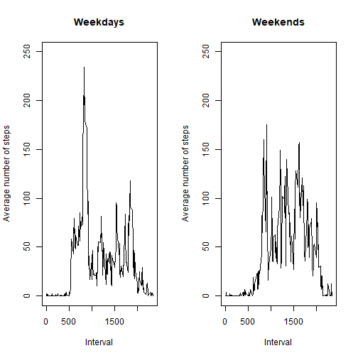

# Reproducible Research - Coursera  
## Assignment - 1  
***
### Loading and preprocessing the data  

The data is loaded using 'read.csv'.

```r
x <- read.csv("activity.csv")
```

The date column was changed from factor class to date class.

```r
x$date <- as.Date(as.character(x$date))
```
***
### What is mean total number of steps taken per day?  

The subset of the initial dataframe which does not have NA's in the steps column.

```r
x_new <- x[!is.na(x$steps),]
```

Calcutale the total number of steps taken per day.

```r
x_sum <- tapply(x_new$steps, x_new$date, sum)
```

Histogram(not barplot) plot of total number of steps taken per day.

```r
hist(x_sum, xlab = "Days", main = "Total number of steps taken each day")
```


Caculating the mean and median of the total number of steps taken per day.

```r
x_mean <- mean(x_sum)
x_median <- median(x_sum)
```

Mean is 1.0766189 &times; 10<sup>4</sup> and median is 10765.

***
### What is the average daily activity pattern?  
Average number of strps taken across all days in a given 5-minute interval. And a new variable 'intervals' which stores the intervals.

```r
x_avg <- tapply(x_new$steps, x_new$interval, mean)
intervals <- as.numeric(levels(factor(x_new$interval)))
```

Time series plot of the above:

```r
plot(intervals, x_avg, type = "l", xlab = "Interval", ylab = "Average number of steps", main = "Average number of steps in each interval")
```


Max number of steps taken across all days in the 5-minutes interval.

```r
max_step <- intervals[which(x_avg == max(x_avg))]
```
Max number of steps taken is 835.

***
### Imputing missing values  
Calculating total number of missing values.

```r
missing <- sum(is.na(x$steps))
```
Total number of missing values are 2304.

I am using the mean of 5-minutes interval average to fill in the missing values in steps.

The new dataset 'y' is made.

```r
y <- x
y[which(is.na(x$steps)),]$steps <- x_avg
```

Time series plot of total number of steps taken each day of the new dataset.

```r
y_sum <- tapply(y$steps, y$date, sum)
hist(y_sum, xlab = "Days", main = "Total number of steps taken each day")
```


Calculating mean and median of the new dataset.

```r
y_mean <- mean(y_sum)
y_median <- median(y_sum)
```

The new mean is 1.0766189 &times; 10<sup>4</sup> which is equal to the old mean 1.0766189 &times; 10<sup>4</sup>, therefore there is no change in the mean of the data.

The new median is 1.0766189 &times; 10<sup>4</sup> which is greater than the old mean 10765.

***
### Are there differences in activity patterns between weekdays and weekends?  
Creating a new variable for the dataset named 'day' which stores whether the day is 'weekday' or 'weekend'.

```r
x_new$day <- ""
x_new[grep("S(at|un)", weekdays(x_new$date)),]$day <- "weekend"
x_new[!(x_new$day == "weekend"),]$day <- "weekday"
x_new$day <- factor(x_new$day, levels = c("weekend","weekday"))
```

Panel plot of average number of steps taken on all weekdays or weekend days.

```r
par(mfrow = c(1,2))
x_avg_weekday <- tapply(x_new[x_new$day %in% "weekday",]$steps, x_new[x_new$day %in% "weekday",]$interval, mean)
x_avg_weekend <- tapply(x_new[x_new$day %in% "weekend",]$steps, x_new[x_new$day %in% "weekend",]$interval, mean)
plot(intervals, x_avg_weekday, type = "l", xlab = "Interval", ylab = "Average number of steps", main = "Weekdays", ylim = c(0,250))
plot(intervals, x_avg_weekend, type = "l", xlab = "Interval", ylab = "Average number of steps", main = "Weekends", ylim = c(0,250))
```


